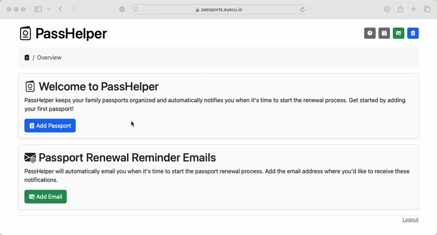
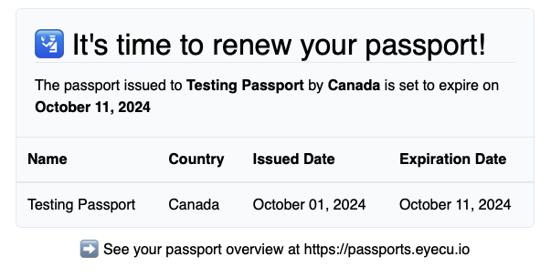
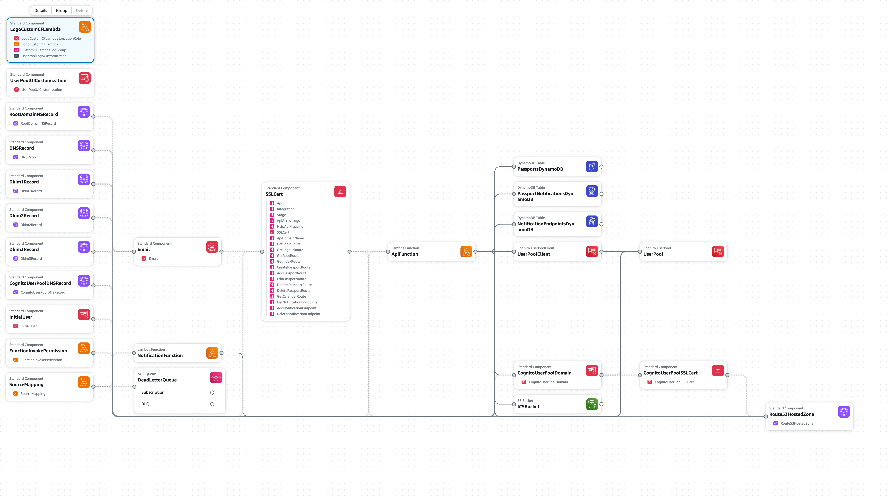

**A self-hosted application passport tracking built using Kotlin, GraalVM and deployed as a custom AWS Lambda runtime.**

PassHelper ensures you never miss a passport renewal for you or your family.

You'll receive an automated email reminder six months before any passport expires. You can also download a calendar file that includes each passport's expiration date and a reminder event set six months in advance.

The PassHelper web app displays all passwords grouped by expiration year.
This overview gives you quick insights into whose passport is expiring next.

PassHelper can be deployed to your personal AWS account using CloudFormation.
The application is built entirely using AWS Serverless resources.
Using Serverless ensures you are only billed when using the application;
there are no fixed monthly costs caused by continuously running resources.

# Overview and Features

PassHelper was built to keep track of our family passports.
They expire on different dates and are issued by various countries,
making it difficult to determine who needs to renew their passports next.

The core features of PassHelper are:
- An overview that gives you a quick glance at whose passport expires when
- Email reminders that will be automatically triggered 6 months before any passport expires
- The ability to export a calendar file with all passport expiration dates as well as reminder events before the passports expire
- An excuse to build an app using Graal and host everything in Lambda





# Application Architecture


PassHelper is hosted using API Gateway and Lambda.
API Gateway provides the application routes and integrates with Lambda.
The application running in Lambda provides handlers for the API Gateway routes and consumes request data, to generate server-side HTML.
The primary database is DynamoDB.
AWS Cognito is used for authentication. 

There are two application Lambda functions:
a Lambda
that handles API Gateway requests `APIGatewayEntrypoint` and a secondary Lambda that handles sending reminder emails `NotificationListenerEntrypoint`.
A DynamoDB stream triggers the notification Lambda.
By using the DynamoDB TTL feature, deletion events are captured in this stream.
These deletions, in turn, trigger the reminder email.

The advantage of this backend stack is the billing model; all used services are pay-per-request.

The application is written in Kotlin and compiled into a native binary using GraalVM. Thymeleaf is used to generate HTML. It runs in a custom Lambda runtime. AWS SAM builds and deploys the application as part of a CloudFormation stack.

# Deploying to your AWS Account

Running this application requires your own AWS account.
Building and deploying the application is hopefully almost an entirely automated process.

## Prerequisites
- An AWS account
- A domain and an associated [Route53 Hosted Zone](https://docs.aws.amazon.com/Route53/latest/DeveloperGuide/hosted-zones-working-with.html)
- [AWS SAM CLI](https://docs.aws.amazon.com/serverless-application-model/latest/developerguide/install-sam-cli.html)
- [AWS CLI](https://aws.amazon.com/cli/)
- Docker
- A verified SES account or a [verified SES email address](https://docs.aws.amazon.com/ses/latest/dg/creating-identities.html#verify-email-addresses-procedure)

## Deployment Steps

1) Clone this repository and `cd` into the directory root :) 
2) (optional) Use CloudFormation to deploy the `passhelper-env.cf.yaml` stack

```shell
aws cloudformation deploy --template-file passhelper-env.cf.yaml --stack-name {Your application name} --no-fail-on-empty-changeset --capabilities CAPABILITY_IAM   
```

This stack sets up an S3 bucket for storing deployed application archives.
You need to provide the name of this bucket when deploying the actual application.
If you already have an S3 bucket, you can pass this bucket name to the deployment step instead.

3) Build the application Docker image

```shell
./build-image.sh
```

You can use the included `build-image.sh` script to do this.
This script runs `docker build` and applies the tag referenced by AWS SAM in `samconfig.toml`.
This tag needs to be used for AWS SAM to build everything as is.

4) Build and deploy the application and CloudFormation stack

```shell
./cf-build-deploy.sh -n {Application name e.g. passhelper} -d {Your domain} -u {your SES verified email address} -b {The S3 bucket from step 2}  
```

This step will compile the application source into a native binary using the Docker container from step 3.
You can use the included `cf-build-deploy.sh` script to do this.
After the application is built, the CloudFormation stack will be deployed.
You will get a temporary login password emailed to the address you provided.

Hopefully this goes smoothly, but if not, check out [First-deploy Troubleshooting](#deployment-troubleshooting).

5) Log in and change your password

You should receive a temporary password from `no-reply@verificationemail.com`.
Go to https://passports.{Your domain} and use your email address and the temporary password to log in!
(Cognito includes a `.` at the end of the email, this is not part of the temporary password.)

6) (optional) Apply Cognito Customizations

By default, the Cognito login screen does not match the application style.
You can change this by including the `CognitoCustomizations` CloudFormation stack.
This stack is in `passhelper.cf.yaml` but commented out by default.
This is because of Cognito timing issues when creating this stack for the first time.

After setting everything up for the first time you can apply customizations by including the `CognitoCustomizations` stack and redeploying the application. 

## Deployment Troubleshooting
There are a few known issues that may cause hangups when deploying PassHelper for the first time. Once the initial deployment is completed, updates should go much smoother.

#### Creating the stack hangs

When initially deploying PassHelper, sometimes CloudFormation hangs.
This is likely caused by the SSL certificate not being validated.
The SSL certificate uses DNS-based validation, 
but in some cases CloudFormation fails to create the required DNS records in Route53.
I believe this may be caused by a bug in CloudFormation.

The workaround is to manually create the required validation DNS records.
You can do this easily in the AWS console using a single click.
This process should be done while your stack is stuck waiting to deploy.

1) Go to the AWS Certificate Manager
2) Find the certificate created by CloudFormation; this should be `passports.{domain name}`
3) Verify `Status` is unverified
4) Click the "Create records in Route53" button
5) Wait several more minutes, stack deployment should eventually start progressing

This only needs to be done when deploying a new stack.

#### No temporary password received

After the stack is created you should receive an email from SES and AWS Cognito from `no-reply@verificationemail.com`.
The email will contain a temporary password you can use to log in to the app.
In order for this email to be sent, you either need a non-sandboxed SES account or a verified email address.
See more here: https://docs.aws.amazon.com/ses/latest/dg/verify-addresses-and-domains.html

# User Management

AWS Cognito provides both authentication and user management.
The email address entered when standing up the application is used to create an initial user in the Cognito user pool.
Adding, removing, and managing users should be done directly in Cognito.
See more here: https://docs.aws.amazon.com/cognito/latest/developerguide/cognito-user-pools.html
